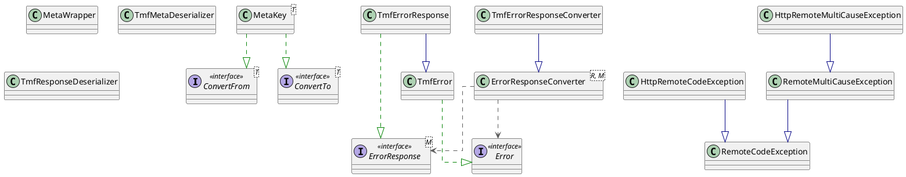

## Error Code Exceptions library for REST

### TMF specification implementation

The following JSON structure displays the implementation of
[TMF specification](https://www.tmforum.org/resources/specification/tmf630-rest-api-design-guidelines-4-2-0) (Part1,
section 3.4)

### TMFErrorResponse (root entity) structure:

| reference       | type              | mandatory | description                                                                                                                   |
|-----------------|-------------------|-----------|-------------------------------------------------------------------------------------------------------------------------------|
| id              | string            | true      | Unique id of this error represented by UUID                                                                                   |
| code            | string            | true      | Error Code in ([A-Z]+-)+\d{4} format                                                                                     |
| reason          | string            | true      | Error title. Does not chane from error instance to instance and does not contain context and secure information               |
| message         | string            | true      | Error detail. Context related information of particular error instance.                                                       |
| @type           | string            | true      | equal to NC.TMFErrorResponse.v1.0                                                                                             |
| @schemaLocation | string            | false     | link to the schema describing a REST resource                                                                                 |
| referenceError  | string            | false     | Url pointing to documentation describing the error                                                                            |
| status          | string            | false     | Http status code                                                                                                              |
| source          | JSON object       | false     | Any object describing the source of the error. Can contain json path to the attribute of the json body which led to the error |
| meta            | JSON object       | false     | JSON map with values as JSON object. May contain any custom data                                                              |
| errors          | array of TMFError | false     | Array of TMFErrors. See [TMFError](#TMFError-structure)                                                                       |

### TMFError structure:

| reference           | type               | mandatory | description                                                                                                                         |
|---------------------|--------------------|-----------|-------------------------------------------------------------------------------------------------------------------------------------|
| id                  | string             | true      | Unique id of this error represented by UUID                                                                                         |
| code                | string             | true      | Error Code in ([A-Z]+-)+\d{4} format                                                                                         |
| reason              | string             | true      | Error title. Does not chane from error instance to instance and does not contain context and secure information                     |
| message             | string             | false     | Error detail. Context related information of particular error instance. Should be null in case error came from another microservice |
| referenceError      | string             | false     | Url pointing to documentation describing the error                                                                                  |
| status              | string             | false     | Http status code                                                                                                                    |
| source              | JSON object        | false     | Any object describing the source of the error. Can contain json path to the attribute of the json body which led to the error       |
| meta                | JSON object        | false     | JSON map with values as JSON object. May contain any custom data                                                                    |

### Class Diagram



### TmfErrorResponseBuilder and TmfErrorResponseConverter

* Convert ErrorCodeException to TmfErrorResponse
```
ErrorCodeException exception = new ErrorCodeException(
        new ErrorCodeHolder("DBAAS-4001", "Attribute cannot be empty"),
        "'attr1' cannot be empty");
        
//  TmfErrorResponse builder with ErrorCodeException as argument allows to set all required fields
TmfErrorResponse response1 = TmfErrorResponse.builder(exception).build();
        
 //  TmfErrorResponse builder for MultiCauseException with additional fields               
TmfErrorResponse response2 = TmfErrorResponse.builder(multiCauseException)
        .referenceError(String.format("https://error-portal-example.nectacker.com/%s",
                multiCauseException.getErrorCode().getCode()))
        .source(Source.builder().pointer("/attr1").build())
        .status(String.valueOf(400))
        .meta(new TreeMap<String, Object>() {{
            put("meta", "meta example");
        }})
        .errors(multiCauseException.getCauseExceptions().stream()
                .map(cause -> TmfError.builder(cause).build())
                .collect(Collectors.toList()))
        .build();
```
* Convert TmfErrorResponse to RemoteCodeException
```
String responseAsString = "...";
TmfErrorResponse remoteError = objectMapper.readValue(responseAsString,
        TmfErrorResponse.class);
RemoteCodeException remoteException = errorResponseConverter.convert(remoteError);
throw new ErrorCodeException(new ErrorCodeHolder("PROJEXT-X-7001", "DBAAS error"),
        "failed to perform DBAAS operation x", remoteException);
```

