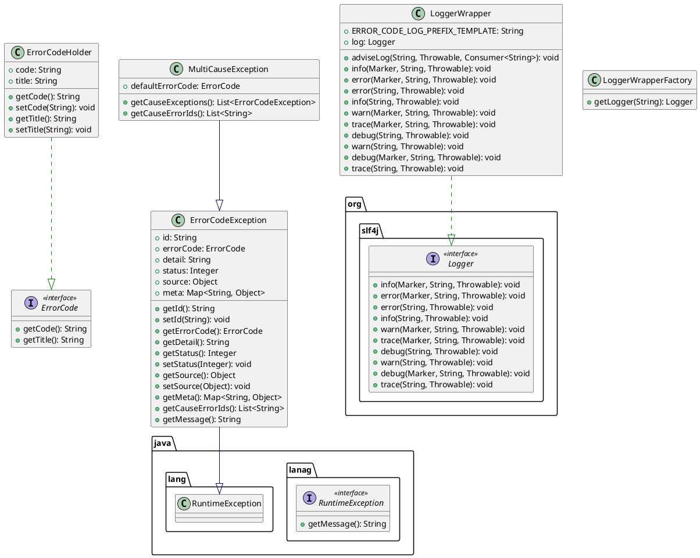

## Error Code Exceptions library

### Class Diagram


### ErrorCodeException composition

| field     | type      | mandatory | description                                               |
|-----------|-----------|-----------|-----------------------------------------------------------|
| id        | String    | true      | unique id (UUID) generated on creation of the exception   |
| errorCode | ErrorCode | true      | interface which provides code and title for the exception |
| detail    | String    | false     | context information related to particular exception       |
| status    | Integer   | false     | http status code, if any                                  |   
| source    | Object    | false     | information of the source of this error, if any           |

### LoggerWrapper purpose
LoggerWrapper implements org.slf4j.Logger and provides advice for methods with Throwable as parameter like:
error(String, Throwable): void

LoggerWrapper meets the following requirements to log message: 
* Log message must contain the following tags only when Throwable passed to one of Logger's methods is instance of ErrorCodeException
  * [error_code={ErrorCodeException.getErrorCode().getCode()}]
  * [error_id={ErrorCodeException.getId()}]
* your custom exception must override java.lang.Throwable.getMessage() method. It must be in the following format:
  ```
  [{error_code}][{error_id}] {message}
  ```
  
#### How to configure LoggerWrapper for usage in your code with Lombok annotations
* add logger implementation to your pom.xml as the dependency, for example:
  ```
  <dependency>
    <groupId>ch.qos.logback</groupId>
    <artifactId>logback-classic</artifactId>
    <version>1.2.11</version>
  </dependency>
  ```

* create logback.xml and put in /resources directory
* provide log pattern for log appenders. For example see the snippet below
  ```
  <appender name="STDOUT" class="ch.qos.logback.core.ConsoleAppender">
    <encoder>
      <pattern>[%d] [%-5p] [request_id=%X{requestId:--}] [tenant_id=%X{tenantId:--}] [traceId=%X{traceId:--}] [spanId=%X{spanId:--}] [thread=%thread] [class=%c{1}] %m%n
    </encoder>
  </appender>
  ```
* create lombok.config file in your maven module directory
* populate this file with the following content:
  ```
  lombok.log.custom.declaration = org.slf4j.Logger org.qubership.cloud.core.log.LoggerWrapperFactory.getLogger(NAME)
  ```
* annotate your classes where you will invoke log methods with @lombok.CustomLog annotation
* write to log with the following code
  ```
  log.error("test log message", exception);
  ```
#### Example of log message for ErrorCodeException with cause as multi-cause exception
  ```
  [2022-05-19 13:49:23,605] [ERROR] [request_id=-] [tenant_id=-] [traceId=-] [spanId=-] [thread=http-nio-0.0.0.0-8001-exec-1] 
  [class=c.n.c.e.t.a.m.c.ErrorHandler] [error_code=MS-1-1002] [error_id=4a3447c3-60f4-45b7-b888-5fe20cd5e52e] caught exception
  org.qubership.cloud.errors.test.app.ms2.error.SimpleServiceException: 
  [MS-1-1002][4a3447c3-60f4-45b7-b888-5fe20cd5e52e] Failed to proxy request due to remote error
    at org.qubership.cloud.errors.test.app.ms2.service.SimpleService.lambda$proxy$0(SimpleService.java:44)
	at org.qubership.cloud.errors.test.app.ms2.error.ErrorProxyException.lambda$new$0(ErrorProxyException.java:19)
	at org.qubership.cloud.errors.test.app.ms2.controller.ErrorHandler.handleErrorCodeException(ErrorHandler.java:46)
    ...
  Caused by: org.qubership.cloud.error.rest.exception.RemoteMultiCauseException: 
  [NC-COMMON-2100][98fc5e1d-b332-412a-9a86-d4695f248c62] multi-cause error
	Suppressed: org.qubership.cloud.error.rest.exception.RemoteCodeException: 
	[MS-2-4001][69eedf03-851d-4d89-9559-943acade5aa2] validation error (simple msg)
	Suppressed: org.qubership.cloud.error.rest.exception.RemoteCodeException: 
	[MS-2-4002][7c2e3f67-6b74-4015-8d9c-fa244be89021] validation error (simple msg)
  ```
